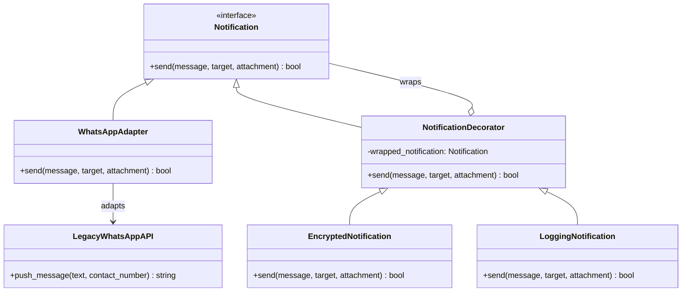

# 1.YARATIMSAL ÖRÜNTÜLER 
Factory Method Uygulandı.
Nerede: notification_system.py Dosyasında NotificationFactory classında kullanıldı.
Neden: Bildirim tipleri tek bir sınıf içerisindeydi ve if-else bloklarıyla karmaşık bir yapıyla kontrol ediliyordu.Hepsini farklı birimlere ayırmamız gerekliydi.
Ne Kazandık ? : Yeni bir bildirim tipi eklenmek istendiği zaman sadece yeni bir class açmamız yeterli,Ayrıca her classlar sadece kendine ait prensipler ile dolduruldu tek sorumluluk prensibine uygun bir yapı oluşturuldu.

# 2. YAPISAL ÖRÜNTÜLER
Adapter ve Decorator uygulandı.

# Adapter 
Nerede: notification_system.py Dosyasında LegacyWhatsAppAPI classını adapte edebilmek için WhatsAppAdapter classında kullanıldı.
Neden: push_message metodu bizim kalıp metodumuz olan send ile uyumlu değildi.Adapter kullanarak uyumlu hale getirdik.
Ne Kazandık ? : Açık Kapalı Prensibi güçlendirilmiş oldu ayrıca yeni özellikler sisteme güvenli bir şekilde adapte edildi.

# Decorator 
Nerede : Classlara özellik eklemek için EncryptedNotification ve LoggingNotification classlarında kullanılmıştır.  
Neden : Şifreleme ve loglama özelliklerini eklemek için kullanıldı.
Ne Kazandık ? : Classlarda herhangi bir düzenleme yapmadan yeni özellikler eklenme kolaylığı sağlandı bununla beraber tek sorumluluk prensibi korundu.

### UML DİYAGRAMI (Faz 2)

# 3. DAVRANIŞSAL ÖRÜNTÜLER

# Command
Nerede: SendNotificationCommand ve NotificationInvoker classlarında kullanıldı.
Neden: Bildirim gönderme isteklerini bir kuyruk yapısına almak için kullanıldı.
Ne Kazandık ? : Şuanki mevcut kodlara dokunmadan sisteme "geri al" veya "tekrar dene" özelliklerini eklendi.

# Observer
Nerede: EventManager classında audit_logger_listener ile analytics_listener fonksiyonlarında kullanıldı.
Neden: Loglama ve istatistik işlemlerini ana iş akışından ayırmak için kullanıldı.
Ne Kazandık ? : Artık sisteme bir şey eklerken ana sınıfları değiştirmeye gerek kalmadı.