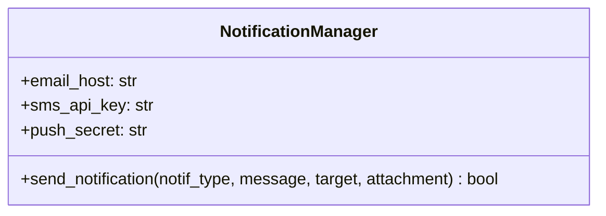

# 1.YARATIMSAL ÖRÜNTÜLER 
Factory Method Uygulandı.
Nerede: notification_system.py Dosyasında NotificationFactory classında kullanıldı.
Neden: Bildirim tipleri tek bir sınıf içerisindeydi ve if-else bloklarıyla karmaşık bir yapıyla kontrol ediliyordu.Hepsini farklı birimlere ayırmamız gerekliydi.
Ne Kazandık ? : Yeni bir bildirim tipi eklenmek istendiği zaman sadece yeni bir class açmamız yeterli,Ayrıca her classlar sadece kendine ait prensipler ile dolduruldu tek sorumluluk prensibine uygun bir yapı oluşturuldu.

<<<<<<< phase-2
# 2. YAPISAL ÖRÜNTÜLER
Adapter ve Decorator uygulandı.

# Adapter 
Nerede: notification_system.py Dosyasında LegacyWhatsAppAPI classını adapte edebilmek için WhatsAppAdapter classında kullanıldı.
Neden: push_message metodu bizim kalıp metodumuz olan send ile uyumlu değildi.Adapter kullanarak uyumlu hale getirdik.
Ne Kazandık ? : Açık Kapalı Prensibi güçlendirilmiş oldu ayrıca yeni özellikler sisteme güvenli bir şekilde adapte edildi.

# Decorator 
Nerede : Classlara özellik eklemek için EncryptedNotification ve LoggingNotification classlarında kullanılmıştır.  
Neden : Şifreleme ve loglama özelliklerini eklemek için kullanıldı.
Ne Kazandık ? : Classlarda herhangi bir düzenleme yapmadan yeni özellikler eklenme kolaylığı sağlandı bununla beraber tek sorumluluk prensibi korundu.

### UML DİYAGRAMI (Faz 2)

=======

### 1.Faz UML Diyagramları 

**Önceki Durum (Spagetti Kod - God Class):**


**Sonraki Durum (Factory Method Uygulanmış Hali):**
>>>>>>> main
```mermaid
classDiagram
    class Notification {
        <<interface>>
        +send(message, target, attachment) bool
    }
<<<<<<< phase-2
    
    %% Adapter Bölümü
    class LegacyWhatsAppAPI {
        +push_message(text, contact_number) string
    }
    class WhatsAppAdapter {
        +send(message, target, attachment) bool
    }
    Notification <|-- WhatsAppAdapter
    WhatsAppAdapter --> LegacyWhatsAppAPI : adapts
    
    %% Decorator Bölümü
    class NotificationDecorator {
        -wrapped_notification: Notification
        +send(message, target, attachment) bool
    }
    class EncryptedNotification {
        +send(message, target, attachment) bool
    }
    class LoggingNotification {
        +send(message, target, attachment) bool
    }
    
    Notification <|-- NotificationDecorator
    NotificationDecorator o-- Notification : wraps
    NotificationDecorator <|-- EncryptedNotification
    NotificationDecorator <|-- LoggingNotification
=======
    class EmailNotification {
        +host: str
        +port: int
        +send(message, target, attachment) bool
    }
    class SMSNotification {
        +api_key: str
        +send(message, target, attachment) bool
    }
    class PushNotification {
        +secret: str
        +send(message, target, attachment) bool
    }
    class NotificationFactory {
        +create_notification(notif_type: str) Notification
    }

    Notification <|-- EmailNotification
    Notification <|-- SMSNotification
    Notification <|-- PushNotification
    NotificationFactory ..> Notification : creates
>>>>>>> main
```