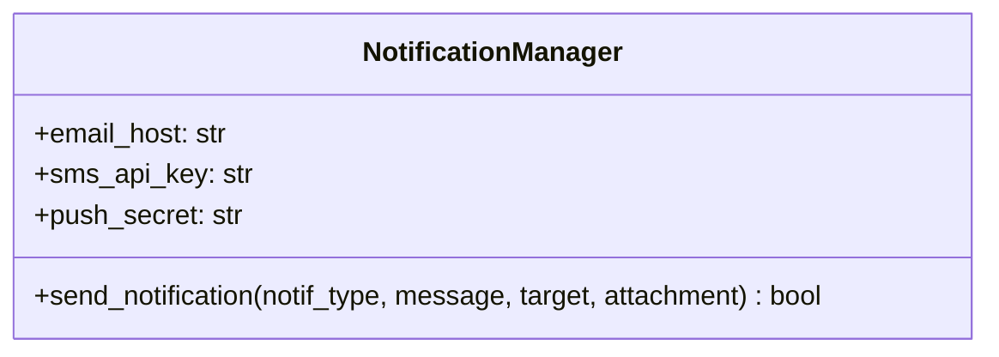
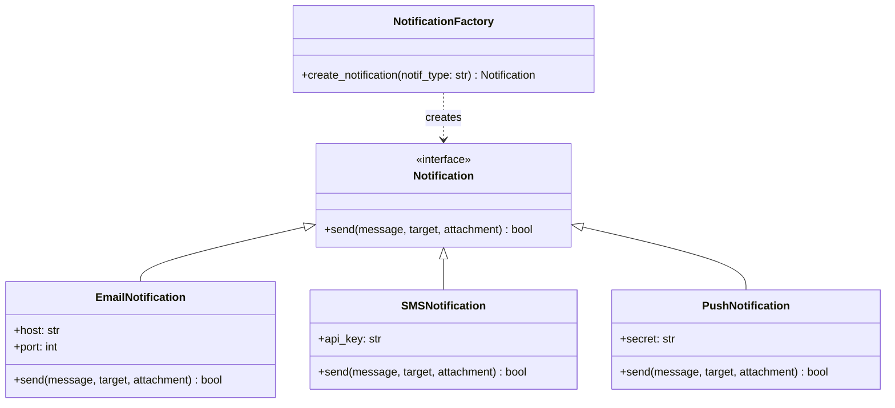

# 1.YARATIMSAL ÖRÜNTÜLER 
Factory Method Uygulandı.
Nerede: notification_system.py Dosyasında NotificationFactory classında kullanıldı.
Neden: Bildirim tipleri tek bir sınıf içerisindeydi ve if-else bloklarıyla karmaşık bir yapıyla kontrol ediliyordu.Hepsini farklı birimlere ayırmamız gerekliydi.
Ne Kazandık ? : Yeni bir bildirim tipi eklenmek istendiği zaman sadece yeni bir class açmamız yeterli,Ayrıca her classlar sadece kendine ait prensipler ile dolduruldu tek sorumluluk prensibine uygun bir yapı oluşturuldu.

### 1.Faz UML Diyagramları 

**Önceki Durum (Spagetti Kod - God Class):**

**Sonraki Durum (Factory Method Uygulanmış Hali):**
