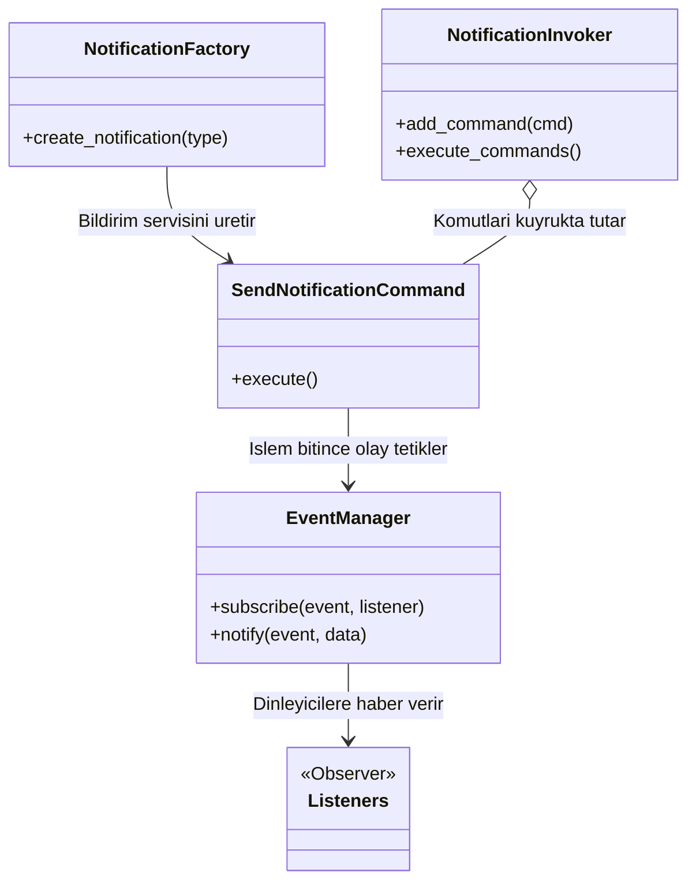

# 241229047-tasarim-oruntuleri-odev
---Seçtiğim Konu : A-Bildirim Sistemi
---Gerekçe : Bildirim yönetimi konusunu yakından görmek ve bu konuda bilgi sahibi olmak istiyorum ayrıca if else ile spaghetti koda dönüşen blokları daha düzenli hale getirmeyi görmek istiyorum.

Proje Ne Yapıyor ? :
Bu proje başlangıçta karmaşık bir yapıda if else zincirleriyle kontrol edilmeye çalışılan bir bildirim sistemiyken Creational Structural Behavioral tasarım örüntüleriyle çok daha düzenli genişletilebilir bir yapıya döndürülmüş halidir.

Kullanılan Tüm Tasarım Örüntüleri :
Factory Method : SMS ve Push gibi bildirimlerin oluşturulma süreci tek bir merkezde toplanmış böylece istemcinin bu detaylarla ilgilenmesine gerek kalmamıştır.
Adapter : Metot imzası uyumsuz olan 'LegacyWhatsAppAPI' servisi mevcut sisteme adapte etmek için kullanılmıştır.
Decorator : Nesnelerin kaynak kod yapısını değiştirmeden şifreleme özelliği kazandırıldı.
Command : Bildirim isteklerini bir kuyruğa almış asenkron şekilde işlemek için zemin hazırlandı.
Observer : Command işlemleri bittiğinde Audit Log ve Analytics gibi dinleyicileri tetiklemek için kullanıldı. 





Nasıl Çalıştırılır ? :

1- Depoyu bilgisayarınıza klonlayın.

2- Terminalden projenin ana dizinine gidin.

3-Aşağıdaki komutu çalıştırarak sistemi başlatın: 
```bash
python src/notification_system.py
```


