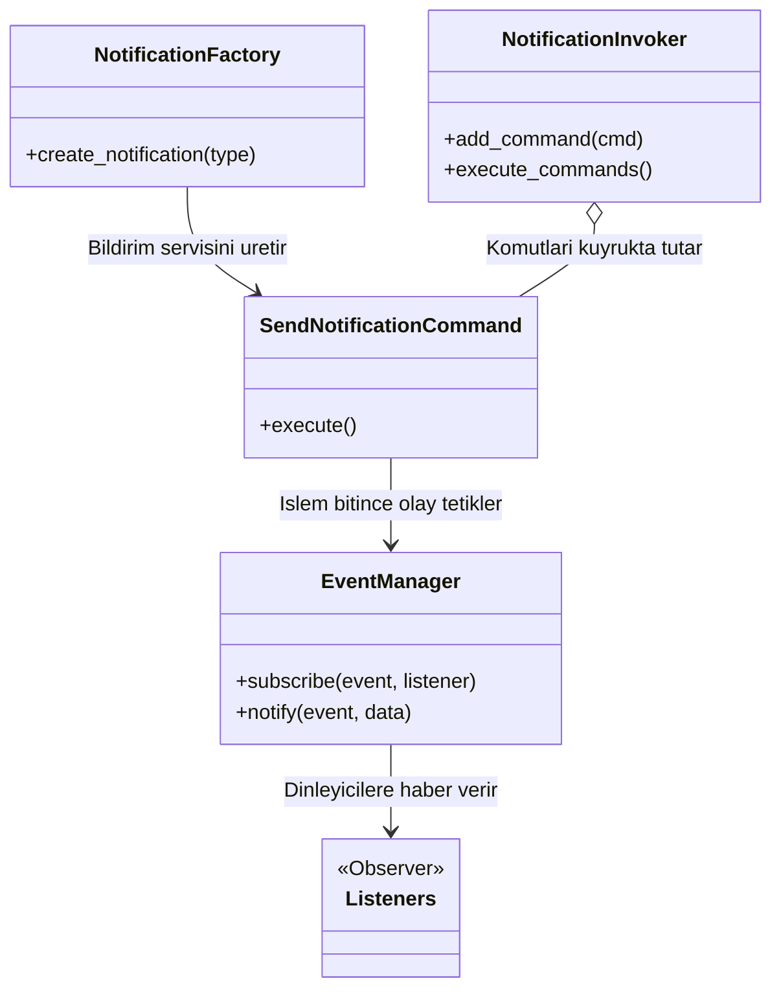

# Sistem Mimari Diyagramı Final

Aşağıdaki diyagram spagetti koddan kurtarılarak Tasarım Örüntüleri ile yeniden yazılan bildirim sisteminin son mimarisini göstermektedir.

```mermaid
classDiagram
    class NotificationFactory {
        +create_notification(type)
    }
    class NotificationInvoker {
        +add_command(cmd)
        +execute_commands()
    }
    class SendNotificationCommand {
        +execute()
    }
    class EventManager {
        +subscribe(event, listener)
        +notify(event, data)
    }
    class Listeners {
        <<Observer>>
    }
    
    NotificationFactory --> SendNotificationCommand : Bildirim servisini uretir
    NotificationInvoker o-- SendNotificationCommand : Komutlari kuyrukta tutar
    SendNotificationCommand --> EventManager : Islem bitince olay tetikler
    EventManager --> Listeners : Dinleyicilere haber verir
```